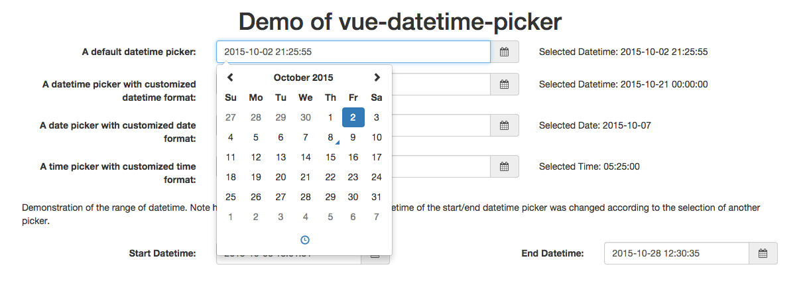

# vue-datetime-picker

[](https://circleci.com/gh/Haixing-Hu/vue-datetime-picker/tree/master)
[](https://coveralls.io/github/Haixing-Hu/vue-datetime-picker?branch=master)
[](https://www.bithound.io/github/Haixing-Hu/vue-datetime-picker)
[](https://david-dm.org/Haixing-Hu/vue-datetime-picker)
[](https://david-dm.org/Haixing-Hu/vue-datetime-picker#info=devDependencies)

A Vue.js component implementing the datetime picker control using the [Eonasdan's bootstrap datetime picker plugin](https://github.com/Eonasdan/bootstrap-datetimepicker).

# Demo

The demo page is [HERE](http://haixing-hu.github.io/vue-datetime-picker/demo.html).



# Requirements

- [Vue.js](https://github.com/yyx990803/vue) `^0.12.0`
- [Eonasdan's bootstrap datetime picker plugin](https://github.com/Eonasdan/bootstrap-datetimepicker) `^4.17.37`

# Instllation

## npm

```shell
$ npm install vue-datetime-picker
```

## bower

```shell
$ bower install vue-datetime-picker
```

# Usage

The HTML snippets are as follows:

```html
<div class="container" id="app">
  <vue-datetime-picker model="{{@ text}}"></vue-datetime-picker>
  <div style="margin-top:40px">
    <div> The HTML contents are as follows:</div>
    <hr>
    <div >{{{text}}}</div>
  </div>
</div>
```

The Javascript snippets are as follows:

```javascript
var Vue = require("vue");

var vm = new Vue({
  el: "#app",
  components: {
    "vue-datetime-picker": require("vue-datetime-picker")
  },
  data: {
    text: "Hello World!"
  }
});
```

# Component Properties

## `model`

The model bind to the control, which must be a two way binding variable.

## `language`

The optional code of language used by the summernote plugin. Default value is `'en-US'`.
Note that the language code passed to this property must be a language code together
with a country code. This limitation is due to names of the i18n localizaiton files
of the summernote plugin.

# API

## `control`

This property is a reference to the JQuery selection of the base texearea
control. It could be used to call the APIs of summernote. For example,
`editor.control.code(val)` will set the HTML content of the editor to the
specified value, where `editor` is the reference to the `vue-datetime-picker`
component.

# Contributing

- Fork it !
- Create your top branch from `dev`: `git branch my-new-topic origin/dev`
- Commit your changes: `git commit -am 'Add some topic'`
- Push to the branch: `git push origin my-new-topic`
- Submit a pull request to `dev` branch of `Haixing-Hu/vue-datetime-picker` repository !

# Building and Testing

First you should install all depended NPM packages. The NPM packages are used
for building and testing this package.

```shell
$ npm install
```

Then install all depended bower packages. The bower packages are depended by
this packages.

```shell
$ bower install
```

Now you can build the project.
```shell
$ gulp build
```

The following command will test the project.
```shell
$ gulp test
```

The following command will perform the test and generate a coverage report.
```shell
$ gulp test:coverage
```

The following command will perform the test, generate a coverage report, and
upload the coverage report to [coveralls.io](https://coveralls.io/).
```shell
$ gulp test:coveralls
```

You can also run `bower install` and `gulp build` together with the following
command:
```shell
npm build
```

Or run `bower install` and `gulp test:coveralls` together with the following
command:
```shell
npm test
```

# License

[The MIT License](http://opensource.org/licenses/MIT)
